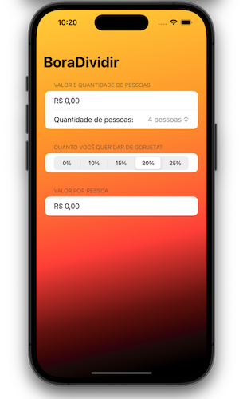

# BoraDividir

## An App to help us to split the bills.

#

## Our Goal

To create a beautiful app that will help us share the tip with our friends.

#

## What I learn

- NavigationView.
- How to property use ZStack and VStack.
- How to property use Sections.
- How to property use the Pickers.
- Text manipulation.
- Background manipulation.

#

> This is a project made from The 100DaysOfSwiftUI, check my portfolio at [andreporto.vercel.app](https://andreporto.vercel.app)
